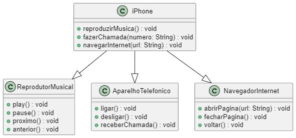

# ## DESAFIO DIO.ME

**DESCRIÇÃO DO DESAFIO**

Chegou a hora de colocarmos em prática toda a concepção de análise de negócios, requisitos, conceitos da programação orientada a objetos e modelagem UML. Com base no vídeo de lançamento do iPhone conforme link abaixo, elabore em uma ferramenta de UML de sua preferência. A diagramação das classes e interfaces com a proposta de representar os papéis do iPhone de: Reprodutor Musical, Aparelho Telefônico e Navegador na Internet. Em seguida crie as classes e interfaces no formato de arquivos .java

**Lançamento iPhone 2017**

Agora é a sua vez de ser o protagonista! Implemente o desafio sugerido pela expert criando um repositório próprio e, com isso, aumentando ainda mais seu portfólio de projetos no GitHub!

**Pré-requisitos**

Lógica de programação e POO;

Conhecimentos básicos(Java);

Computador com SO de sua preferência(Windows, Linux, Mac OS);

IDE (Visual Studio Code, Eclipse, etc);

# REALIZAÇÃO DO DESAFIO

Através do diagrama de classe UML, foi adicionado ao projeto: classes e interfaces que são padrões a funcionalidade do iPhone.
O projeto foi realizado no VsCode juntamente com o diagrama de classes.

**Diagrama de Classe**

## Maximiliano R Pinto